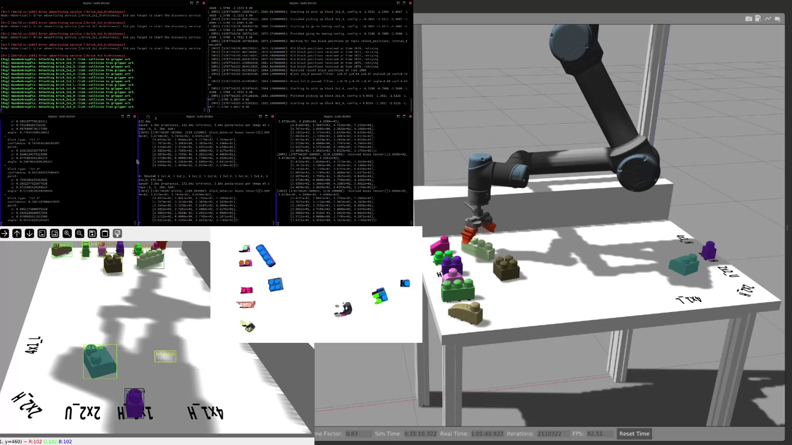

# Robotics project

Done by Pietro Cipriani, Alessio Zeni, Fabio Giovanazzi for the fall semester of 2023 as an assignment for the Fundamentals of Robotics course.

### Video

[](https://github.com/pietrocipriani/progetto-robotica/raw/videos/operational_space.mp4)

Click on the image to download the video demo, or pick one from below here:
- [operational_space.mp4](https://github.com/pietrocipriani/progetto-robotica/raw/videos/operational_space.mp4)
- [joint_space.mp4](https://github.com/pietrocipriani/progetto-robotica/raw/videos/joint_space.mp4)

### Documentation

You can find the project documentation for each part of the project here:
- [Planner](./src/planner/README.md)
- [Position detection](./src/position_detection/Readme.md)
- [Block detector](./src/block_detector/README.md)
- [Controller](./src/controller/README.md)
- [Model training](./vision_training/README.md)

Moreover, we collected all documentation in **doxygen format** for easy access. After downloading this repo, you can open [./html/index.html](./html/index.html) in your browser to view the docs of all methods and classes in the project.

### Folder structure

- `/` the root folder of this repo is a catkin workspace, see [Catkin workspace](#catkin-workspace)
- `src/planner/` contains a catkin package for kinematic calculations
- `src/position_detection/` contains a catkin package that extracts blocks positions from block detections and from the point cloud
- `src/block_detector/` contains the catkin package responsible for detecting blocks in images
- `src/controller/` is the catkin package that connects all components 
- `vision_training/` contains the code that was used to train the YoLoS model that recognizes blocks

### Catkin workspace

The root folder of this repository is a [catkin workspace](http://wiki.ros.org/catkin/Tutorials/create_a_workspace) created using `catkin_make`. In order for the workspace to be active, you need to run `catkin_make` in the root of this repository, and then `source devel/setup.bash`. The latter command can be put in `.bashrc` so that it's executed before starting any terminal session.

### Setting up requirements

This project runs inside https://github.com/mfocchi/locosim. Execute all of the following commands as a normal user, **not** as root.

```
cd ~
git clone https://github.com/pietrocipriani/progetto-robotica
cd progetto-robotica
python3 -m pip install -r requirements.txt
catkin_make
```

Add `source $HOME/progetto-robotica/devel/setup.bash` to `.bashrc` and reopen any terminal to update the sourcing configuration.

Edit the file `~/ros_ws/src/locosim/robot_descriptions/gripper_description/gripper_description/urdf/soft_finger.xacro` on line 25 and increase the upper limit of the gripper to 0.9 (otherwise big blocks can't be picked up):
```diff
- <limit effort="50" velocity="10.0" lower="-0.5" upper="0.3" />
+ <limit effort="50" velocity="10.0" lower="-0.5" upper="0.9" />
```

### Running the project

You will need 4 or 5 terminals open to run the project. Each command below is meant to be run in a separate terminal, but **the order** of commands **should be preserved** and before executing each command, **the previous one should have finished setting up**.

```sh
# runs the main simulation
cd ~/ros_ws/src/locosim/robot_control/base_controllers && python3 ur5_generic.py

# runs the block detection service
rosrun block_detector inspect_detected_blocks.py

# runs the block position detection service,
# and the corresponding visualization
rosrun position_detection precise_placement.py

# runs the controller node
rosrun controller controller_node

# (optional) opens a visualization for detected blocks
rosrun block_detector inspect_detected_blocks.py 6
```

### Shortands

The following commands were useful to work with ROS and with the `mfocchi/locosim` container.

These aliases allow avoiding to use the docker management script in `mfocchi/locosim` which has unwanted defaults and causes other issues. With the following commands the UIs run fine under wayland (thanks to `xhost`), ROS doesn't crash under Arch (thanks to `--ulimit nofile=1024:524288`) and is more straightforward. Replace MY_LAB_HOME and MY_USER appropriately, before adding this to your host computer `.bashrc`.
```
alias lab-robotica-run='sudo docker run --name lab_robotica --gpus all --user="$(id -u):$(id -g)" --workdir="/home/$USER" --volume="/etc/group:/etc/group:ro" --volume="/etc/shadow:/etc/shadow:ro" --volume="/etc/passwd:/etc/passwd:ro" --device=/dev/dri:/dev/dri -e "QT_X11_NO_MITSHM=1" --network=host --hostname=lab_rob_hn --add-host="lab_rob_hn:127.0.1.1" --volume "/tmp/.X11-unix:/tmp/.X11-unix:rw" --volume="MY_LAB_HOME:$HOME" --env=HOME --env=USER --privileged --ipc=host -e SHELL --env="DISPLAY=$DISPLAY" --shm-size=2g --memory=16g --ulimit nofile=1024:524288 -itd mfocchi/trento_lab_framework:introrob && sudo docker exec --user root lab_robotica /usr/bin/sed -i s/%sudo/MY_USER/g /etc/sudoers'
alias lab-robotica-start-x='xhost +local:docker && sudo docker start lab_robotica'
alias lab-robotica-start-w='xhost +local:docker && xhost "+SI:localuser:$(id -un)" && sudo docker start lab_robotica'
alias lab-robotica-user="sudo docker exec -it --user root lab_robotica sh -c 'su MY_USER'"
alias lab-robotica-root='sudo docker exec -it --user root lab_robotica /bin/bash'
```

This alias is useful to kill all jobs in the background, so if a ROS command doesn't terminate, you can Ctrl+Z it and then run `killbg`:
```sh
alias killbg="kill -9 \`ps | grep -v -E 'bash|grep|ps|sed|tee|cat|CMD' | sed 's@^[^0-9]*\([0-9]\+\).*@\1@' | tee >(cat >&2)\`"
```

### Original project description

<details><summary><b>Original project description</b></summary>


## Project n. 1
A number of objects (e.g., mega-blocks) are stored without any specific order on a stand
(initial stand) located within the workspace of a robotic manipulator. The manipulator is an
anthropomorphic arm, with a spherical wrist and a two-fingered gripper as end-effector.
The objects can belong to different classes but have a known geometry (coded in the STL files). The objective of the project is to use the manipulator to pick the objects in sequence and to position them on a different stand according to a specified order (final stand). A calibrated 3D sensor is used to locate the different objects and to detect their position in the initial stand. 
### Assignment
There are multiple objects on the initial stand, one for each class. There is no specific order
in the initial configuration, except that the base of the object is “naturally” in contact with the
ground. Each object has to be picked up and stored in the position prescribed for its class
and marked by the object’s silhouette.
### Delivery rules
The project is developed in groups. The typical group size consists of three-four members. We can also accept groups with a smaller number of members. The group is supposed to work in perfect cooperation and the workload is required to be fairly distributed. The specific contribution of each member will be exposed during the project discussion.
The delivery phase is as follows:

1. The project can be implemented both in simulation or on the real robot. In the second case it will have to be tested in the laboratory with the Teaching Assistant at most 5 least five days before the exam date. During the tests, small videos can be shot and used for the presentation.
2. Each group will have to deliver the package containing the full code (with doxygen documentation and a readme for use) plus a 5-6 pages report describing
    - the technique used for perception
    - the technique used for robot motion 
    - the technique used for high-level planning
3. The delivery deadline is three days before the (oral) exam presentation
4. On the day of the exam, the students will give a 10 minutes presentation highlighting the contribution of each member inside the oral session.
5. If allowed by the time, the group could also be asked to perform a small demo session. Otherwise, we will rely on the clip shot before the exam.

</details>