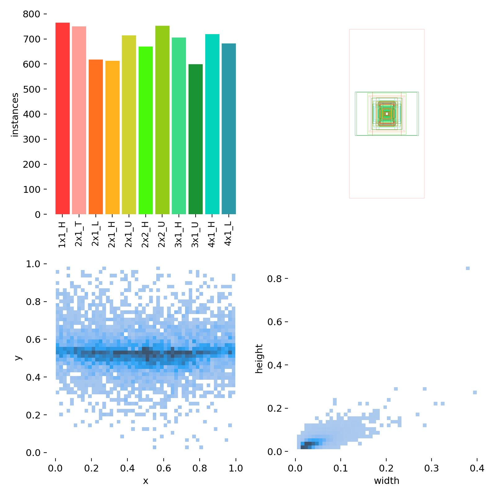
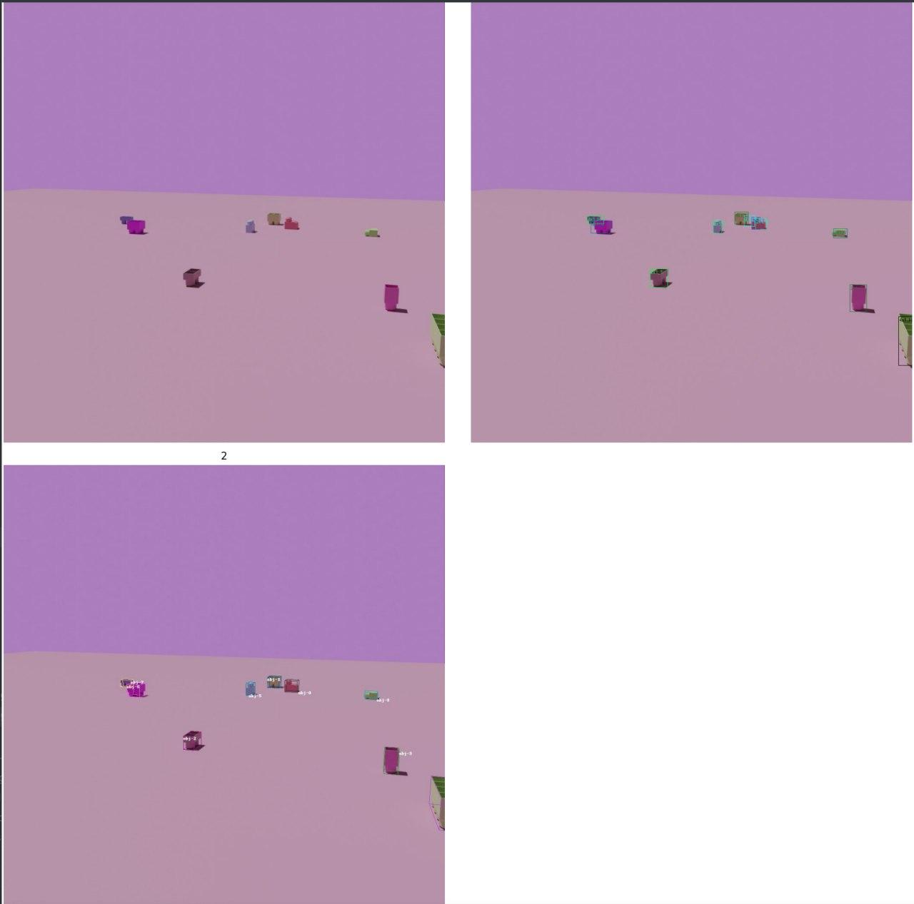
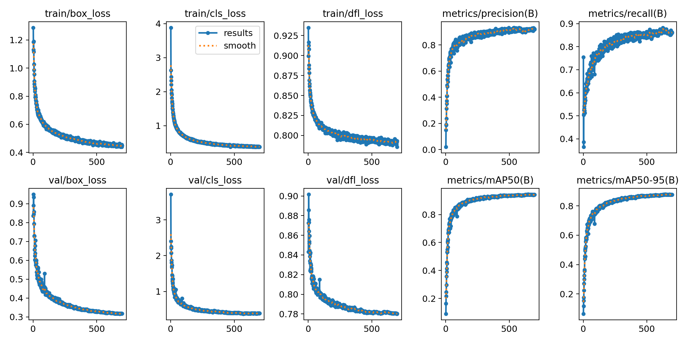
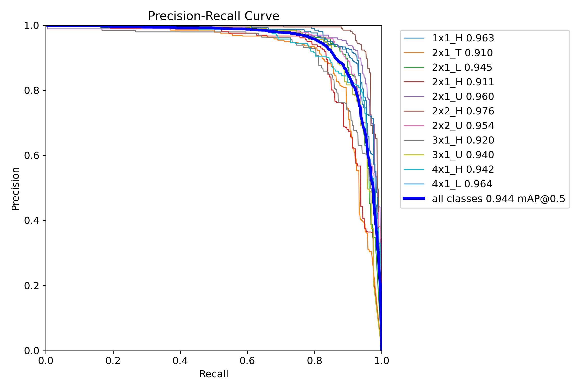
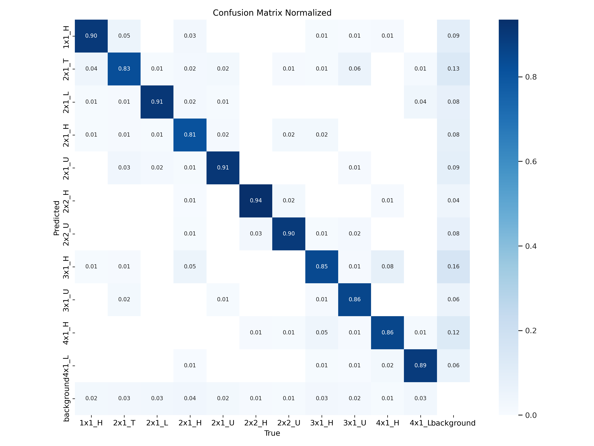
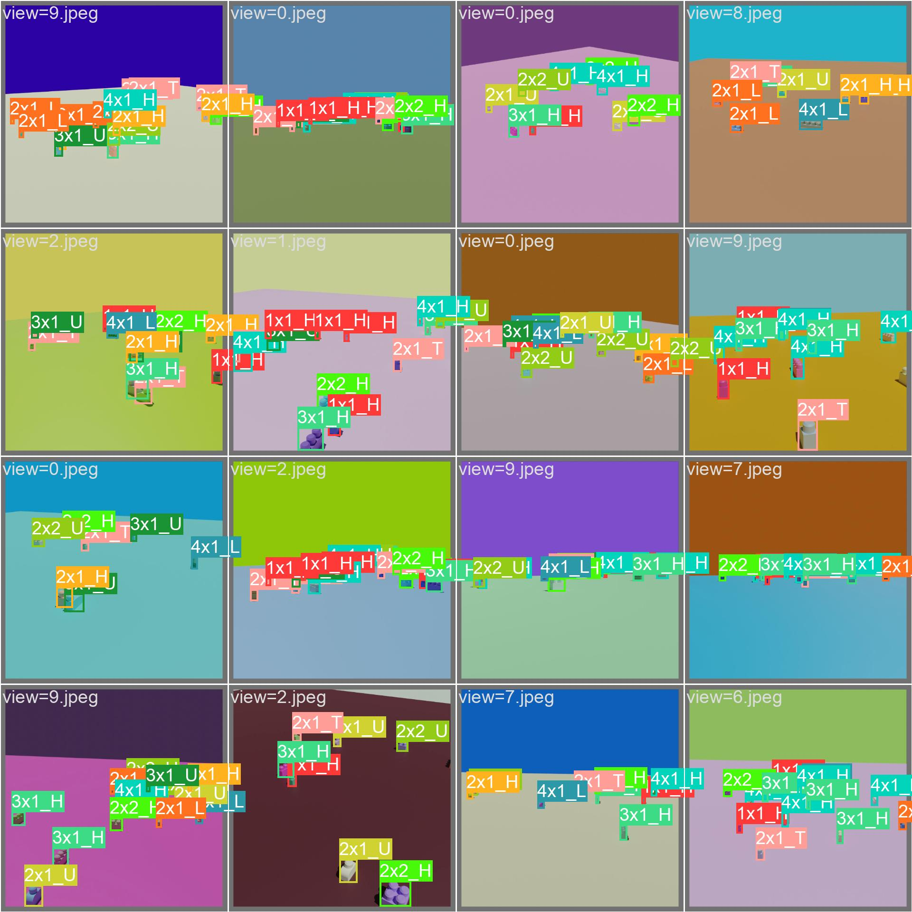
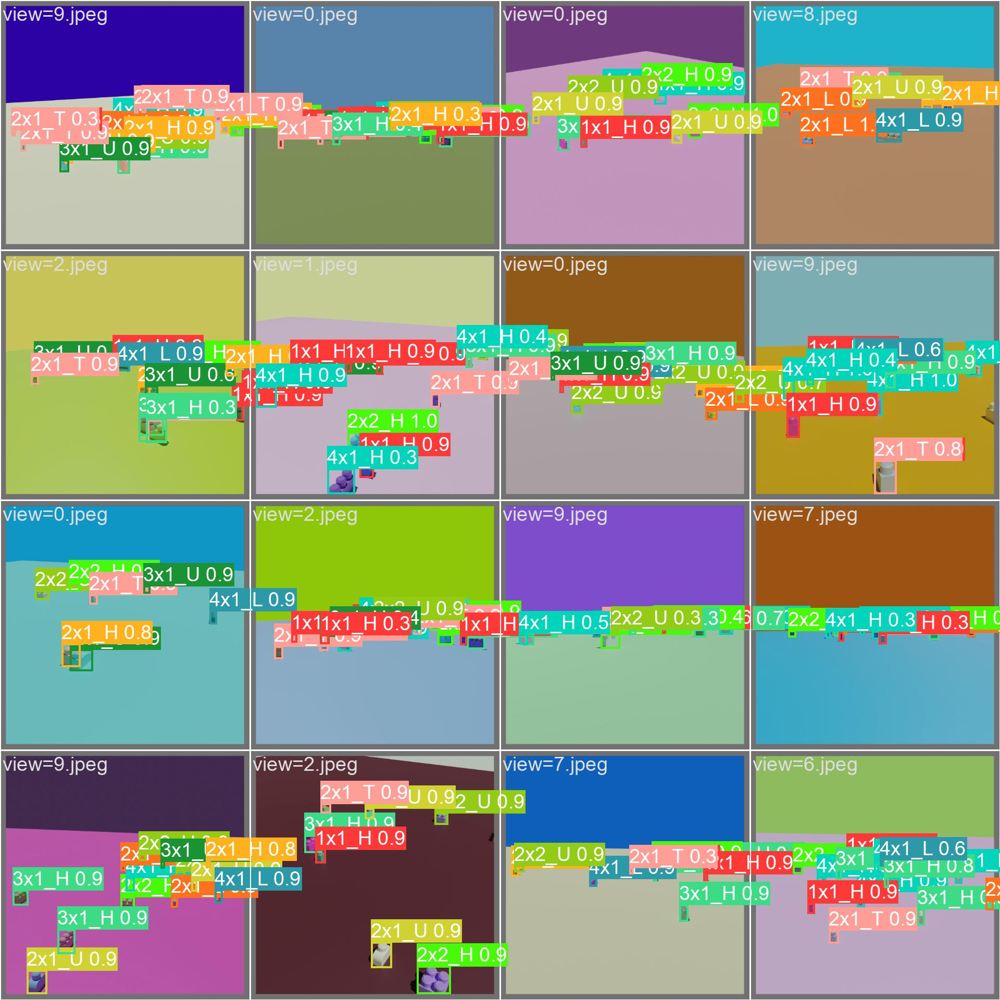

# Training the object detection and recognition model

This part was done by Fabio Giovanazzi.

## Setting up the dataset

The dataset provided for the project consists of 1024x1024 images of blocks taken in simulation, with annotations stored in corresponding `.json` files. This annotation format could not be used directly with model training frameworks and needed to be converted. The `generate_annotations.py` script takes care of this.

A few conversions were also needed:
- the object bounding boxes provided in the `.json` files were wrong, but I was able to calculate the bounding box by finding min/max x/y in the `"vertices"` array
- I did not know that strings such as `"X1-Y2-Z1"` indicated the box label, and so assigned labels based on the number of items in the `"vertices"` array, which turned out to be fully reliable. I have used different names though.

### Block type names

The letter mapping is:
- `H`: all top squares have a circle, the base is high
- `L`: all top squares have a circle, the base is low
- `T`: only half of the top squares have a circle, the other part a half-triangle
- `U`: only half of the top squares have a circle, the other part is U-shaped

The block names are therefore:
- 1x1_H - X1-Y1-Z2
- 2x1_T - X1-Y2-Z2-CHAMFER
- 2x1_L - X1-Y2-Z1
- 2x1_H - X1-Y2-Z2
- 2x1_U - X1-Y2-Z2-TWINFILLET
- 2x2_H - X2-Y2-Z2
- 2x2_U - X2-Y2-Z2-FILLET
- 3x1_H - X1-Y3-Z2
- 3x1_U - X1-Y3-Z2-FILLET
- 4x1_H - X1-Y4-Z2
- 4x1_L - X1-Y4-Z1

### Labels visualization

The following image, generated by ultralytics, depicts the distribution of label types in the dataset.



## First try - Yolos

Starting from the python notebook provided by prof. Sebe during the course, I setup some scripts to train the model, see [train_yolos.py](./train_yolos.py) and [common.py](./common.py).

The results, however, were not good enough. The blocks were getting detected, but with a really low confidence (0.2) and with imprecise bounding boxes. Moreover, labels were set almost at random. I tried changing training parameters in a lot of different ways without any real improvement.

See the image below: at top left original image, at bottom left real boxes, at top right boxes detected by Yolos.



## Second try YOLOv8

After failing with Yolos, I switched to ultralytics' YOLOv8, a state of the art model. The smallest variant, which is the one I used, is just ~7MB, and easily outperformed Yolos after just a couple of epochs of training.

Moreover, the ultralytics training library was really easy to use and provided a lot of information and visualizations about the process that was going on:
- chooses hyperparameters
- performs data augmentation
- stops training when there is no improvement
- generates a lot of useful visualizations in the `runs/` folder
- keeps track of the last and the best models

These **3 lines of code** were enough to get a good model.
```python
from ultralytics import YOLO
model = YOLO("yolov8n.pt")
results = model.train(data="assigns/ultralytics.yaml", epochs=10000, imgsz=640)
```

### Results


These are the training metrics after 700 epochs of training. `mAP@0.5` (i.e. mean Average Precision for an Intersection Over Union threshold of 0.5) reached 0.94158, while `mAP@0.5-0.95` (i.e. mean Average Precision averaged on various for Intersection Over Union threshold ranging from 0.5 to 0.95) reached 0.87621.



On the left is the obtained Precision-Recall curve for an Intersection Over Union threshold of 0.5. On the right is the confusion matrix, which turned out to be really good. In fact, during our final experiments, it only happened rarely that a block in the robot workspace was mislabeled.

| | |
|---|---|
|  |  |

On the left are the real labels, while on the right are the predicted labels.

| | |
|---|---|
|  |  |

